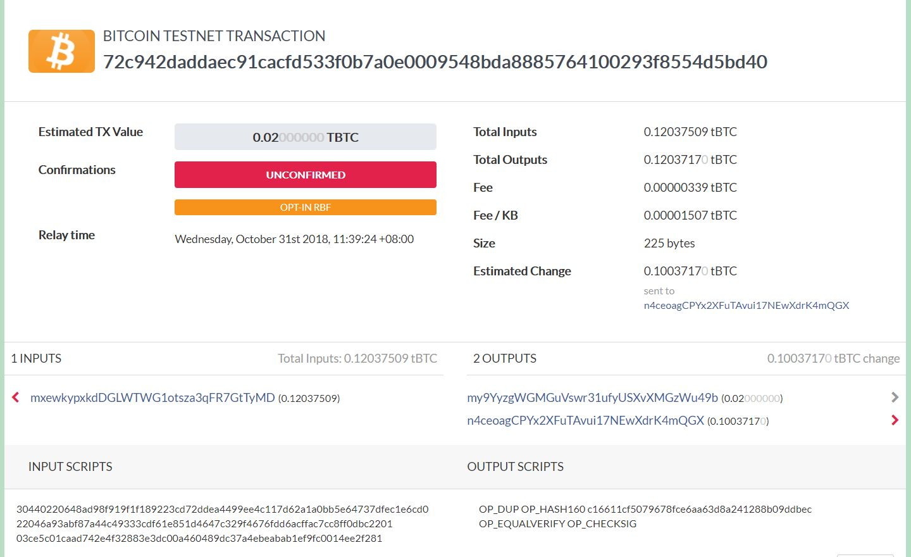

# Electrum testBitcoin

Name: Clemence Goh (1002075)

Question 1
---
- Seed is needed since it is required to generate a random address
- Seed looks like this:
    - laptop charge clap hawk toy pond pony episode ethics original habit anchor
- "Confirmations" counts the number of blocks which have been mined after 
the block containing the transaction has been mined in.
- Transactions look like this:
    - 
- Input:
    - Senders and how much they are sending
- Output:
    - Receivers and how much they are receiving
- No. All the balance from the sender will be sent in a transaction.
However, since the receiver only receives a part of it, the other 
"receiver" of the balance would be the sender.

Question 2
---
Case study:
- Total amount transacted: 3,824.17125018 tBTC (input)
- Receiving addresses:
    - 2N5DKp2kDHoconN3LUtMx8efBQf28BSm3Mt
    - n1gen1haVTyg5Ebgoj8kD2HRaxtSGhDCZP
- When did it happen: Wednesday, September 12th 2018, 23:47:03 +08:00
- Yes, it is different. All amount is paid to another account.

Question 3
---
- The difference lies in the payment only.
- Payment requires all 3 cosigners to agree and create the same transaction

Question 4
---
- OP_5: 5
- OP_1: 5, 1
- OP_AND: 1
- OP_HASH160: ff056d1a4cf78645eb05ac3c0e0dcaf429de0db3
- 628850cb844fe63c308c62afc8bc5351f1952a7f: ff056d1a4cf78645eb05ac3c0e0dcaf429de0db3, 628850cb844fe63c308c62afc8bc5351f1952a7f
- OP_EQUAL: FALSE
